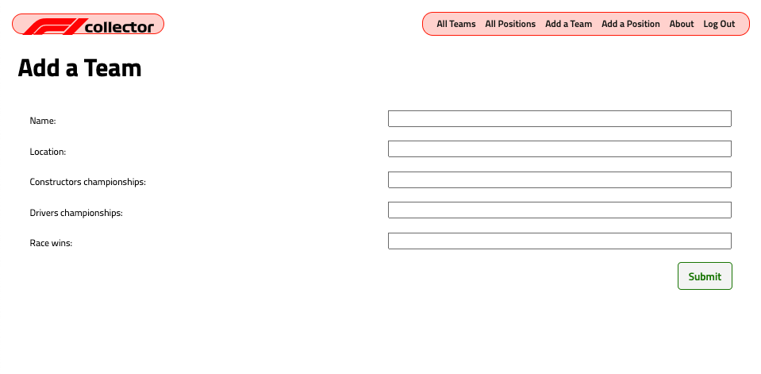
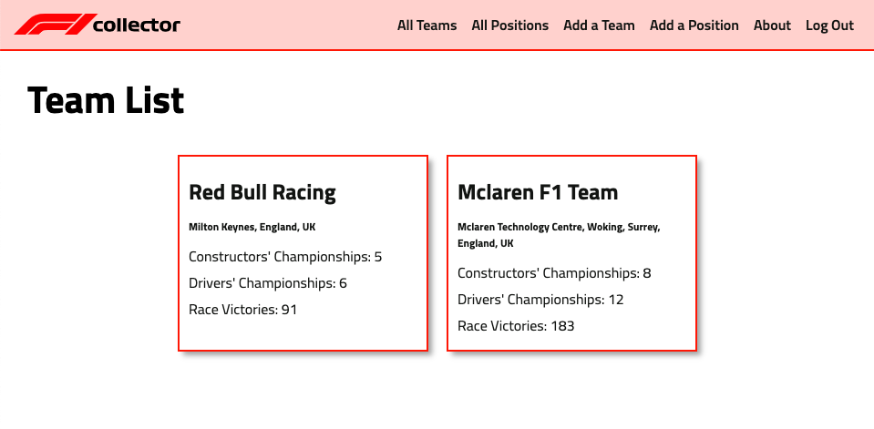
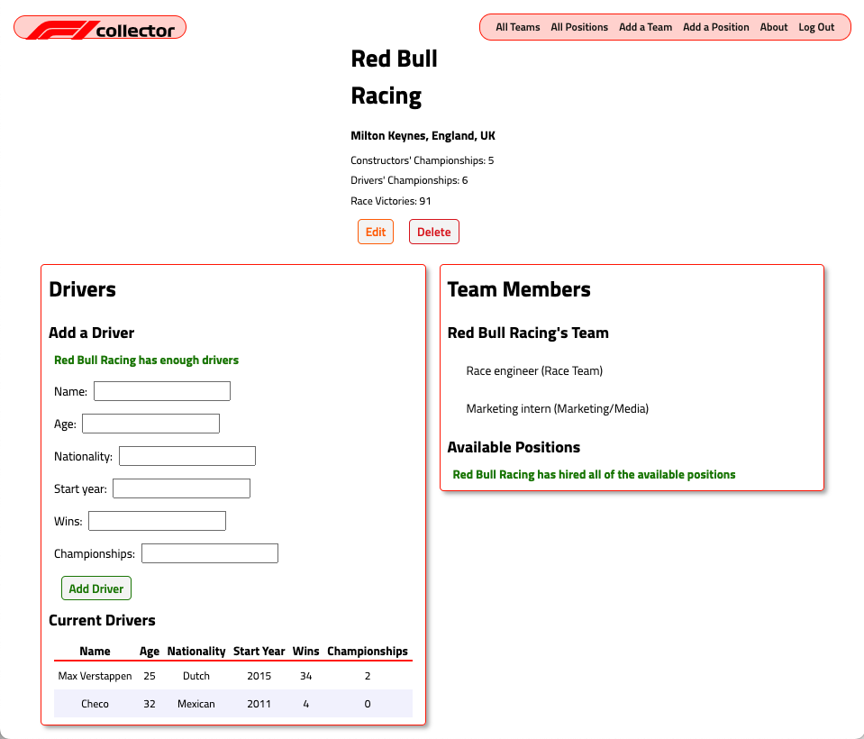

# About F1 Collector
As an avid Formula 1 fan, I wanted a way to keep track of my favorite teams' stats, as well as their drivers' stats. With F1 Collector, fans can store any team, past or present, and keep track of its location, wins, and championships. Fans can also add drivers to the team, as well as keep track of the driver's wins, nationality, starting date, and championships.

### [Click here to launch F1 Collector](https://jhudson-f1-collector.herokuapp.com/)

## Screenshots

## Technologies Used
- Python | Django
- HTML
- CSS
- Dockerfile
- Figma

 ## Future Goals
 - AAU, I should be able to edit a driver's stats.
 - AAU, I should be able to delete a driver from a team.
 - AAU, I should be able to upload an image for the team and/or driver.

### Connect with Me
[LinkedIn](https://www.linkedin.com/in/jameshudson357/)